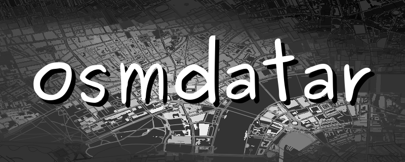

[](https://travis-ci.org/osmdatar/osmdatar)



osmdatar
========

R package for downloading OSM data.

Speed comparisons
-----------------

Speed comparisons can be examined in the branch `speed-comparisons`, with the main branch now just serving the further development of the `Rcpp` versions. The results from that branch (on test data of highways only) are:

| method                     | Computation time (s) |
|----------------------------|----------------------|
| osmplotr                   | 1.86                 |
| hrbrmstr                   | 1.47                 |
| Rcpp (-&gt;`sp` in `R`)    | 0.25                 |
| Rcpp (-&gt;`sp` in `Rcpp`) | 0.08                 |

Processing everything, including the construction of the `sp` S4 objects, within `Rcpp` routines is obviously enourmously faster, and the package will now be constructed to generalise all other kinds of OSM objects.

------------------------------------------------------------------------

Install
-------

``` r
setwd ("..")
#devtools::document ("osmdatar")
devtools::load_all ("osmdatar")
setwd ("./osmdatar")
```

Note that `devtools::document` overwrites `NAMESPACE` yet fails to insert the necessary line, `useDynLib(osmdatar)`. This must be manually reinserted for the package to load properly!

------------------------------------------------------------------------

Speed test
----------

This speed test uses `get_xml_doc` which is simply `get_highways` without the final line:

``` r
get_xml_doc <- function (bbox=NULL)
{
    bbox <- paste0 ('(', bbox [2,1], ',', bbox [1,1], ',',
                    bbox [2,2], ',', bbox [1,2], ')')

    key <- "['highway']"
    query <- paste0 ('(node', key, bbox,
                    ';way', key, bbox,
                    ';rel', key, bbox, ';')
    url_base <- 'http://overpass-api.de/api/interpreter?data='
    query <- paste0 (url_base, query, ');(._;>;);out;')

    dat <- httr::GET (query)
    if (dat$status_code != 200)
        warning (httr::http_status (dat)$message)
    # Encoding must be supplied to suppress warning
    httr::content (dat, "text", encoding='UTF-8')
}
```

Then the actual speed test:

``` r
txt <- get_xml_doc (bbox=bbox)
mb <- microbenchmark ( obj <- rcpp_get_highways (txt), times=100L )
tt <- formatC (mean (mb$time) / 1e9, format="f", digits=2)
```

``` r
cat ("Mean time to convert with Rcpp code =", tt, "\n")
```

    ## Mean time to convert with Rcpp code = 0.08
