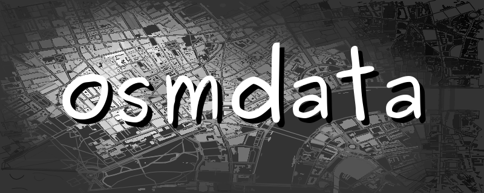

<!-- README.md is generated from README.Rmd. Please edit that file -->
[](https://travis-ci.org/ropensci/osmdata) [](https://ci.appveyor.com/project/ropensci/osmdata) [](https://codecov.io/gh/ropensci/osmdata) [](http://cran.r-project.org/web/packages/osmdata) [](http://joss.theoj.org/papers/0f59fb7eaeb2004ea510d38c00051dd3) [](http://cran.r-project.org/package=osmdata) [](http://www.repostatus.org/#active)



`osmdata` is an R package for accessing OpenStreetMap (OSM) data using the [Overpass API](http://wiki.openstreetmap.org/wiki/Overpass_API). The Overpass API (or OSM3S) is a read-only API that serves up custom selected parts of the OSM map data. Map data can be returned either as [Simple Features (`sf`)](https://cran.r-project.org/package=sf) or [Spatial (`sp`)](https://cran.r-project.org/package=sp) objects.

### Installation

``` r
library(osmdata)
#> Data (c) OpenStreetMap contributors, ODbL 1.0. http://www.openstreetmap.org/copyright
packageVersion("osmdata")
#> [1] '0.0.4'
```

### Usage

[Overpass API](http://wiki.openstreetmap.org/wiki/Overpass_API) queries can be built from a base query constructed with `opq` followed by `add_feature`. The corresponding OSM objects are then downloaded and converted to `R Simple Features (sf)` objects with `osmdata_sf()` or to `R Spatial (sp)` objects with `osmdata_sp()`. For example,

``` r
q0 <- opq(bbox = c(-0.27, 51.47, -0.20, 51.50)) # Chiswick Eyot in London, U.K.
q1 <- add_feature(q0, key = 'name', value = "Thames", value_exact = FALSE)
x <- osmdata_sf(q1)
x
```

    #>  Object of class 'osmdata' with:
    #>                   $bbox : 51.47,-0.27,51.5,-0.2
    #>          $overpass_call : The call submitted to the overpass API
    #>              $timestamp : [ Wed 4 May 2017 09:33:52 ]
    #>             $osm_points : 'sf' Simple Features Collection with 21459 points
    #>              $osm_lines : 'sf' Simple Features Collection with 1916 linestrings
    #>           $osm_polygons : 'sf' Simple Features Collection with 23 polygons
    #>         $osm_multilines : 'sf' Simple Features Collection with 5 multilinestrings
    #>      $osm_multipolygons : 'sf' Simple Features Collection with 3 multipolygons

OSM data can also be downloaded in OSM XML format with `osmdata_xml()` and saved for use with other software.

``` r
osmdata_xml(q1, "data.xml")
```

The `XML` document is returned silently and may be passed directly to `osmdata_sp()` or `osmdata_sf()`

``` r
doc <- osmdata_xml(q1, "data.xml")
x <- osmdata_sf(q1, doc)
```

Or data can be read from a previously downloaded file:

``` r
x <- osmdata_sf(q1, "data.xml")
```

For more details, see the [website](https://ropensci.github.io/osmdata/)

### Style guide

We appreciate any contributions; those that comply with our general coding style even more. In four short points:

1.  `<-` not `=`
2.  Indent with four spaces
3.  Be generous with other white spaces - you've got plenty of real estate on that big screen of yours.
4.  Code is much easier to read when braces are vertically aligned, so please put `{` in the same vertical position as `}`.

### Code of Conduct

Please note that this project is released with a [Contributor Code of Conduct](CONDUCT.md). By participating in this project you agree to abide by its terms.

[](http://ropensci.org)
