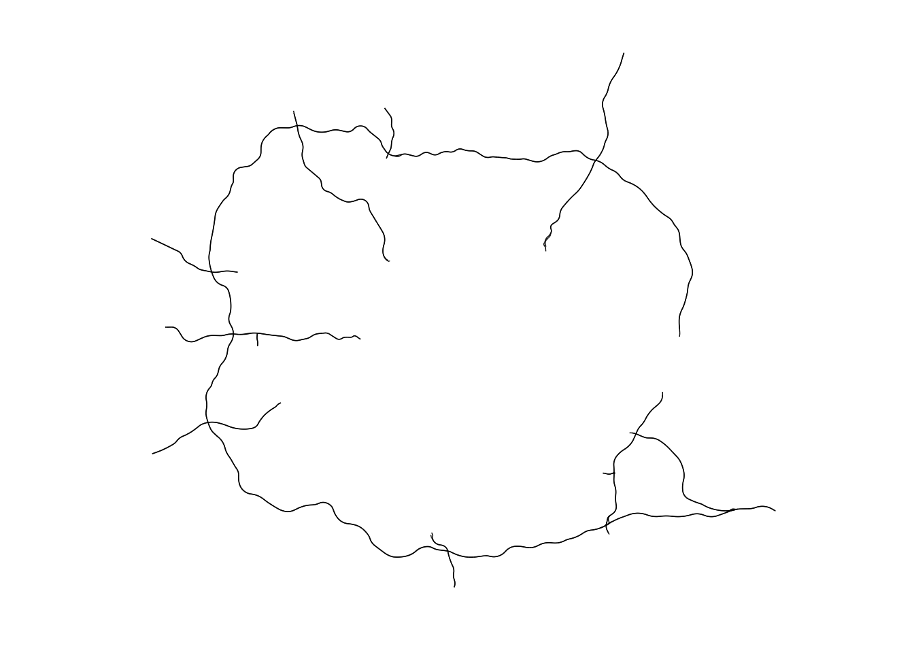

<!-- README.md is generated from README.Rmd. Please edit that file -->
overpass is a packge with tools to work with the OpenStreetMap (OSM) [Overpass API](http://wiki.openstreetmap.org/wiki/Overpass_API). To explore simple Overpass queries interactively, try [overpass turbo](http://overpass-turbo.eu/).

Here's an [RPub](http://rpubs.com/hrbrmstr/overpass) for `overpass` that I'll continually update as this goes (that will eventually be a vignette).

The Overpass API (or OSM3S) is a read-only API that serves up custom selected parts of the OSM map data. It acts as a database over the web: the client sends a query to the API and gets back the data set that corresponds to the query.

Unlike the main API, which is optimized for editing, Overpass API is optimized for data consumers that need a few elements within a glimpse or up to roughly 100 million elements in some minutes, both selected by search criteria like e.g. location, type of objects, tag properties, proximity, or combinations of them. It acts as a database backend for various services.

Overpass API has a powerful query language (language guide, language reference, an IDE) beyond XAPI, but also has a compatibility layer to allow a smooth transition from XAPI.

The following functions are implemented:

-   `overpass_query`: Issue OSM Overpass Query
-   `read_osm`: Read an XML OSM Overpass response from path

### News

-   Version 0.0.0.9005 released - HUGE speed improvement; passes CRAN checks;
-   Version 0.0.0.9000 released

### Installation

``` r
devtools::install_github("hrbrmstr/overpass")
```

### Usage

``` r
library(overpass)
library(sp)
library(ggmap)

# current verison
packageVersion("overpass")
#> [1] '0.0.0.9005'
```

``` r
# CSV example
osmcsv <- '[out:csv(::id,::type,"name")];
area[name="Bonn"]->.a;
( node(area.a)[railway=station];
  way(area.a)[railway=station];
  rel(area.a)[railway=station]; );
out;'

opq <- overpass_query(osmcsv)
read.table(text = opq, sep="\t", header=TRUE, 
           check.names=FALSE, stringsAsFactors=FALSE)
#>          @id @type               name
#> 1   26945519  node    Bonn-Oberkassel
#> 2 1271017705  node         Bonn-Beuel
#> 3 2428355974  node Bonn-Bad Godesberg
#> 4 2713060210  node  Bonn Hauptbahnhof
#> 5 3400717493  node        Bonn-Mehlem
```

``` r
# just nodes
only_nodes <- '[out:xml];
node
  ["highway"="bus_stop"]
  ["shelter"]
  ["shelter"!~"no"]
  (50.7,7.1,50.8,7.25);
out body;'

pts <- overpass_query(only_nodes)
plot(pts)
```


``` r
# ways & nodes
nodes_and_ways <- '[out:xml];
(node["amenity"="fire_station"]
    (50.6,7.0,50.8,7.3);
  way["amenity"="fire_station"]
    (50.6,7.0,50.8,7.3);
  rel["amenity"="fire_station"]
    (50.6,7.0,50.8,7.3););
(._;>;);
out;'

wys <- overpass_query(nodes_and_ways)
plot(wys)
```


``` r
# xml version of the query
actual_ways <- '<osm-script output="xml">
  <query type="way">
    <bbox-query e="7.157" n="50.748" s="50.746" w="7.154"/>
  </query>
  <union>
    <item/>
    <recurse type="down"/>
  </union>
  <print/>
</osm-script>'

awy <- overpass_query(actual_ways)
plot(awy)
```


``` r
# more complex example from Robin: motorways surrounding London
# warning: may take a few minutes to run
from_robin <- '[out:xml][timeout:100];
(
  node["highway"="motorway"](51.24,-0.61,51.73,0.41);
  way["highway"="motorway"](51.24,-0.61,51.73,0.41);
  relation["highway"="motorway"](51.24,-0.61,51.73,0.41);
);
out body;
>;
out skel qt;'

frb <- overpass_query(from_robin)

gg <- ggplot()
gg <- gg + geom_path(data=fortify(frb), 
                     aes(x=long, y=lat, group=group),
                     color="black", size=0.25)
gg <- gg + coord_quickmap()
gg <- gg + ggthemes::theme_map()
gg
ggsave("README-from_robin-1.png")
```



### Test Results

``` r
library(overpass)
library(testthat)

date()
#> [1] "Tue Aug 11 11:38:46 2015"

test_dir("tests/")
#> testthat results ===========================================================
#> OK: 4 SKIPPED: 0 FAILED: 0
#> 
#> DONE
```

### Code of Conduct

Please note that this project is released with a [Contributor Code of Conduct](CONDUCT.md). By participating in this project you agree to abide by its terms.
